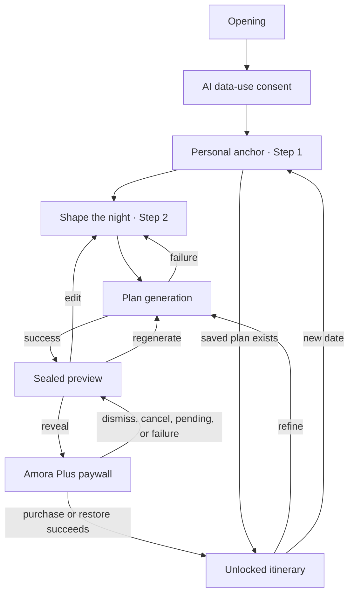

# PRD: Amora iOS App Design Refresh

Date: 2026-07-21
Status: Draft for product confirmation
Platform: iPhone, iOS 18+
Scope: Product UI only; marketing and App Store creative are out of scope

## 1. Summary

Redesign every screen in the Amora iOS app as one coherent, premium experience inspired by the supplied references. The refresh must retain Amora's thoughtful, editorial personality while bringing the references' midnight burgundy, warm cream, coral, and brass visual language into a native, accessible interface.

The references are a mood and hierarchy target, not a literal component specification. Their strong editorial type, romantic palette, and sense of anticipation should carry into the app. Their exaggerated 3D cards, glow, tiny text, and poster-like compositions should not be copied into functional screens.

## 2. Assumptions

- The existing MVP product flow and product decisions remain in scope and unchanged.
- The app remains iPhone-only and supports iOS 18 or later.
- Both system Light and Dark appearances are required; Amora follows the user's system appearance and does not add an app-specific theme switch.
- The current data contract remains unchanged. Venue photography is therefore not required for the MVP; consistent category artwork is used where the references show photos.
- The free preview continues to hide exact venues, addresses, timing, detailed costs, and Apple Maps actions.
- This document defines design requirements only. It does not authorize a SwiftUI implementation.

## 3. Product Context

### Primary user

Single men, roughly 24–38, who already have a date to plan and want it to feel thoughtful without spending hours researching. They may arrive feeling uncertain or time-constrained. The interface should replace that uncertainty with calm, considered confidence.

### Core job

Turn a small amount of personal context and a few practical constraints into a credible, personal three-stop date itinerary.

### Primary action

Give Amora enough context to create a thoughtful plan, then confidently reveal and use the prepared itinerary.

### Experience words

Intimate. Composed. Perceptive.

The corresponding physical reference is a carefully typeset restaurant itinerary or letterpress invitation on heavy cream stock, opened in low evening light.

## 4. Goals

- Establish one recognizable Amora visual system across every screen and state.
- Make the dark appearance feel close to the references: deep wine-black backgrounds, layered burgundy surfaces, warm light text, coral interaction accents, and restrained brass details.
- Preserve a warm ivory, editorial light appearance.
- Choose one native icon family and one purposeful type pairing.
- Give each screen its own composition based on its task instead of repeating a generic stack of cards.
- Make the sealed preview feel valuable before purchase without leaking paid details.
- Make the unlocked plan read as one connected itinerary rather than three unrelated venue cards.
- Support Dynamic Type, VoiceOver, Increased Contrast, Reduce Motion, and minimum 44×44 pt targets.

## 5. Non-goals

- Changing subscription strategy, pricing, or the StoreKit product.
- Adding accounts, profiles, maps, reservations, current events, image upload, or screenshot analysis.
- Adding live venue photography or a new image service.
- Recreating the references' promotional poster layout inside the app.
- Using glow, glass, shadows, or 3D depth as decoration on every component.
- Designing the website, App Store screenshots, or social creative.

## 6. Reference Interpretation

| Reference signal | Keep | Translate for the app | Avoid |
| --- | --- | --- | --- |
| Midnight burgundy atmosphere | Rich wine-black canvas and warm highlights | Semantic dark tokens and three surface levels | Pure black, red-on-black low contrast, constant glow |
| Warm cream itinerary | Paper-like content surfaces | Ivory light surfaces and warm off-white dark text | Pure white cards |
| Editorial serif headlines | Strong emotional hierarchy | New York for display roles | Serif body copy or long form controls |
| Clean sans-serif support copy | Fast scanning | SF Pro for UI, body, labels, and numbers | Mixing several sans-serif families |
| Coral and pink emphasis | Emotional accent and primary actions | Coral for dark-mode links/focus; deeper oxblood button fill | Pink on every label or icon |
| Brass and green metadata | Useful secondary meaning | Brass for time; olive for cost and fit signals | Color as the only carrier of meaning |
| Floating 3D cards | A sense of revealed layers | One elevated focal surface where it supports hierarchy | Every control in its own floating card |
| Sparkles, hearts, paths | Romantic character | Sparse decorative moments and category artwork | Emoji or mixed icon packs |

## 7. Information Architecture



## 8. Visual System

### 8.1 Icon set

Use **SF Symbols** for all functional interface icons.

Why:

- It is native to iOS and aligns weight, baseline, and scale with SF Pro.
- Symbols scale with Dynamic Type and work with accessibility settings.
- The current app already uses SF Symbols, so the decision removes inconsistency without adding a dependency.

Rules:

- Use outline or monochrome symbols for controls and navigation.
- Use hierarchical or two-color palette rendering only for large, noninteractive category artwork.
- Match symbol weight to neighboring text, usually regular or semibold.
- Every icon-only action needs an accessibility label and a 44×44 pt hit area.
- Do not mix Lucide, Material, Font Awesome, emoji, or generated 3D icons into product UI.
- Do not use an SF Symbol in the app icon or trademark. The brand mark remains custom artwork.
- Use `sparkles` only for generation, personalization, and the brand reveal. It must not become generic decoration.

Canonical mapping:

| Meaning | SF Symbol |
| --- | --- |
| Back | `chevron.left` |
| Continue / disclosure | `chevron.right` |
| Personal context | `heart.text.square` or `heart` where unavailable |
| Detect current area | `location.fill` |
| Planning area | `mappin.and.ellipse` |
| Vibe | `heart` |
| Budget | `banknote` |
| No drinking | `wineglass` plus a visible text label; never icon-only |
| Duration | `clock` |
| Generate / personalize | `sparkles` |
| Locked details | `lock.fill` |
| Preview | `eye` |
| Edit preferences | `slider.horizontal.3` |
| Regenerate | `arrow.clockwise` |
| Previous plan | `clock.arrow.circlepath` |
| Apple Maps action | `map` |
| New date | `plus` |
| Error | `exclamationmark.triangle.fill` |
| Success | `checkmark.circle.fill` |

Venue category artwork may use `cup.and.saucer.fill`, `books.vertical.fill`, `photo.artframe`, `birthday.cake.fill`, `leaf.fill`, `music.note`, and `fork.knife`, matching the current model-driven categories.

### 8.2 App icon and brand mark

The functional icon decision does not solve the app icon. The current white “A” plus heart mark has thin details, a hard black field, and loses clarity at small sizes.

Create a separate app-icon exploration with these constraints:

- One custom mark combining a path, heart, and subtle “A” gesture.
- Oxblood or midnight-wine field with an ivory mark; coral may be a small highlight.
- No text, fine hairlines, transparency, photo realism, drop shadow, or SF Symbols.
- Must remain recognizable at 40×40 px and in monochrome notification contexts.
- Produce light, dark, and tinted iOS appearance variants during implementation.

This exploration is a design deliverable, not part of the screen wireframes.

### 8.3 Typography

Use **New York + SF Pro**, accessed through SwiftUI system designs rather than embedded font files.

- **New York**: plan titles, screen titles, and the lowercase `amora` wordmark. It carries the editorial, intimate voice seen in the references.
- **SF Pro**: body copy, fields, controls, metadata, buttons, prices, and legal text. It keeps interactive content native and highly legible.
- **SF Pro monospaced digits**: aligned duration and price values where numeric stability matters.

Type roles:

| Role | Typeface | SwiftUI text style | Weight | Notes |
| --- | --- | --- | --- | --- |
| Plan title | New York | `largeTitle` | Bold | Maximum 3–4 lines; never truncate |
| Screen title | New York | `title2` | Bold | Tight visual grouping with helper text |
| Section title | New York or SF Pro | `title3` | Semibold | New York only for narrative sections |
| Body | SF Pro | `body` | Regular | Default reading role |
| Supporting copy | SF Pro | `subheadline` | Regular | Dark mode gets slightly more line spacing |
| UI label | SF Pro | `subheadline` | Semibold | Sentence case |
| Metadata | SF Pro | `caption` | Semibold | Never below 11 pt at default size |
| Legal | SF Pro | `caption2` | Regular | Keep link targets at least 44 pt high |

Rules:

- Use Dynamic Type text styles instead of fixed point sizes.
- Support all accessibility text sizes without truncating primary content.
- Use no more than the two families above.
- Avoid italics in controls. New York italics may appear only in a short editorial phrase, never required information.
- Do not use uppercase for paragraph copy or primary buttons.

### 8.4 Color tokens

All custom colors must be semantic Color Set assets with Light, Dark, Increased Contrast Light, and Increased Contrast Dark variants. Do not hard-code theme values in views.

| Semantic role | Light | Dark | Use |
| --- | --- | --- | --- |
| `backgroundBase` | `#F7F2E9` | `#17090E` | Primary canvas |
| `backgroundRaised` | `#FFFDF8` | `#241017` | Standard surface |
| `backgroundElevated` | `#FFF8F1` | `#31131D` | Sheets and focal surfaces |
| `textPrimary` | `#211A17` | `#F9EDEF` | Primary text |
| `textSecondary` | `#746B63` | `#D8BEC3` | Supporting text |
| `accentText` | `#6E1F2B` | `#E75A7C` | Links, focus, selected text, brand word |
| `actionFill` | `#6E1F2B` | `#A91F49` | Primary button background |
| `actionText` | `#FFFDF8` | `#FFF8F3` | Primary button text |
| `brass` | `#795720` | `#F1B85B` | Time and warm emphasis |
| `olive` | `#536B4E` | `#9BC497` | Cost, fit, and success support |
| `borderSubtle` | `#E3D8CA` | `#875562` | Dividers and essential control boundaries |
| `error` | `#9B2435` | `#FF8A92` | Error icon and text |

Verified WCAG contrast examples:

- Light primary text on the light background: 15.38:1.
- Light secondary text on the light background: 4.68:1.
- Light primary-button text on oxblood: 10.91:1.
- Dark primary text on the dark background: 17.00:1.
- Dark secondary text on the dark background: 11.16:1.
- Dark coral accent on the dark background: 5.69:1.
- Dark primary-button text on the dark action fill: 6.70:1.

Color behavior:

- Dark mode is not an inversion. Depth comes from progressively lighter wine surfaces, not shadows.
- Use the 60/30/10 principle by visual weight: warm neutral canvas, ink/surface structure, and sparse accents.
- Oxblood/coral always signals brand or interaction. Brass and olive are supporting accents, not competing CTAs.
- Never rely on red/green alone. Pair color with text, shape, or a symbol.
- The only permitted atmospheric gradient is a subtle branded wash on Opening and Plan Generation. Content screens use stable solid semantic surfaces.

### 8.5 Spacing, shape, and elevation

Use a 4 pt base scale: 4, 8, 12, 16, 20, 24, 32, 48, 64.

- Screen horizontal inset: 20 pt compact iPhones, 24 pt where width allows.
- Related text spacing: 4–8 pt.
- Control-group spacing: 12–16 pt.
- Section spacing: 24–32 pt.
- Primary touch targets: minimum 44×44 pt.
- Control corner radius: 12 pt.
- Standard surface radius: 16 pt.
- Focal or sheet surface radius: 24 pt.
- Pills use capsule geometry.
- Light mode may use one restrained ambient shadow on elevated focal surfaces only.
- Dark mode uses no ambient card shadow; elevation comes from surface lightness and essential borders.
- Do not put every field or row in a separate card. Prefer grouped sections and separators.

### 8.6 Motion and haptics

- Opening reveal: 500–700 ms, opacity and scale only.
- Page transition feedback: 200–300 ms, ease-out.
- Button press: 100–150 ms scale to 0.98, returning smoothly.
- Preview reveal: stagger the three itinerary stops by no more than 60 ms each.
- Loading statuses crossfade; do not bounce or spin decorative hearts.
- Success after unlock: one restrained `success` haptic and a short lock-to-check symbol transition.
- Selection controls use light haptics only when the selection changes.
- Reduce Motion replaces movement with short crossfades and removes stagger.
- Never show fake percentage progress for plan generation.

### 8.7 Accessibility and localization

- Meet WCAG AA-equivalent contrast in both appearances and Increased Contrast modes.
- Support Dynamic Type through all accessibility sizes.
- Use VoiceOver order that follows the visual task order.
- Expose group labels and selected values for vibe, budget, duration, and no-drinking controls.
- Keep primary information when text grows; controls may stack vertically.
- Provide visible labels; placeholders never replace labels.
- Use locale-aware currency from the plan data and support longer currency names.
- Avoid hard-coded gender in accessibility labels. Existing product copy remains as approved until a separate copy decision changes it.
- Test with Reduce Motion, Bold Text, Button Shapes, Differentiate Without Color, and Increased Contrast.

## 9. Screen-by-Screen Requirements

### 9.1 Opening

Purpose: Establish recognition and give the app enough time to load StoreKit products without feeling stalled.

Composition:

- Full-screen branded field respecting safe areas.
- Centered custom Amora mark, with the `amora` wordmark beneath it.
- Dark appearance uses midnight wine with a soft oxblood halo; light appearance uses warm ivory with a faint blush wash.
- No body copy, carousel, or CTA.

States:

- Default duration remains approximately 1.4 seconds.
- Reduce Motion uses a static mark and crossfade.
- Asset must have separate Light and Dark variants to avoid an abrupt theme flash.

Acceptance:

- Mark stays crisp on the smallest supported iPhone.
- Transition lands in the correct system appearance without a white or black flash.

### 9.2 AI data-use consent

Purpose: Explain what is shared before the user enters personal context, then obtain one-time acceptance.

Composition:

- Small `amora` wordmark at the top.
- New York title: “A quick note before we plan.”
- One concise supporting paragraph.
- One grouped disclosure surface with a leading `sparkles` symbol and three plain-language rows: planning area, selected preferences, and optional personal context.
- Privacy and Terms links remain visible near the disclosure, not hidden below the fold.
- Primary `Continue` action anchored after the content; it may pin above the safe area on short screens.

States:

- Default.
- Links visited and returning to the app.
- Very large Dynamic Type, where the CTA follows the content rather than covering it.

Acceptance:

- Consent is understandable without legal knowledge.
- Continue is never presented as accepting marketing or analytics; the app collects neither for the MVP.

### 9.3 Personal anchor — Step 1 of 2

Purpose: Capture the detail that will make the plan feel specific and ground it in a real planning area.

Composition:

- Compact navigation bar with `Plan with Amora` and a quiet “1 of 2” progress label.
- New York title: “What would make her feel seen?”
- Helper copy as currently approved.
- A large, always-labeled text editor styled as the page's focal paper surface. Minimum visible height should suggest 5 lines.
- A separate “Plan near” group with a text field and `Detect my area` action.
- Location suggestions appear as an attached list below the field, not as nested cards.
- If available, the previous-plan entry appears as a compact secondary row below location, visually separate from form fields.
- `Continue` is the only primary action.

States:

- Empty personal context.
- Text editor focused, keyboard visible.
- Long pasted note up to the product limit.
- Empty location.
- Typing with zero, one, or several suggestions.
- Detecting area.
- Permission denied or location lookup failed.
- Valid suggested area selected.
- Saved previous plan available.
- Editing preferences for an existing preview or unlocked plan.

Acceptance:

- Personal context remains technically optional.
- Location error appears directly below the location group with icon, cause, and corrective action.
- Keyboard does not cover Continue or the active location suggestion.

### 9.4 Shape the night — Step 2 of 2

Purpose: Collect practical constraints without making the experience feel like a settings form.

Composition:

- Explicit Back action and quiet “2 of 2” progress label.
- New York title: “Shape the night.”
- Vibe uses a two-column adaptive grid of six selectable chips: Cozy, Adventurous, Romantic, Low-key, Foodie, Outdoorsy. Replace the current menu picker.
- Budget is the focal control: local-currency amount at trailing edge, discrete slider, minimum/maximum context, and the existing reassurance copy.
- No drinking is a full-width labeled switch row. The default remains off.
- Duration uses the existing four-option segmented control, stacking gracefully at accessibility sizes.
- `Create My Date Plan` is the only primary action and includes `sparkles`.

States:

- Every vibe selected state.
- Every local-currency budget option.
- No-drinking on and off.
- Every duration.
- Create disabled, pressed, and submitting.
- Validation, offline, rate-limit, and generic-generation errors.
- Editing while a previous plan exists, with `Back to Plan` as a secondary action.

Acceptance:

- Selected controls are differentiated by fill, border, symbol/checkmark, and accessibility value—not color alone.
- The budget value remains readable for long currency labels.

### 9.5 Plan generation

Purpose: Make a meaningful wait feel active, considered, and trustworthy.

Composition:

- Branded full-screen atmosphere matching the selected appearance.
- New York heading: “Amora is working.”
- Status copy cycles through the four existing messages.
- A minimal three-stop itinerary scaffold appears progressively: three numbered rows with concealed text lines. This previews the shape of the result without inventing data.
- A small indeterminate progress indicator remains for clear system feedback.

States:

- Initial consideration.
- Scouting nearby locations.
- Matching constraints.
- Finalising the plan.
- Reduce Motion.
- Generation failure returns to Step 2 with preserved inputs and a focused corrective message.

Acceptance:

- No fake percentage or fake venue name.
- The wait screen remains calm if generation takes longer than one status cycle.

### 9.6 Sealed preview

Purpose: Prove that the plan is thoughtful and specific while preserving paid value.

Composition:

- Small `amora` wordmark, plan title in New York, and compact summary badges.
- A “Sealed preview” eyebrow with an `eye` or `lock.fill` symbol.
- Three stops form one vertical itinerary. A thin neutral connector may link numbered stops, but the content surfaces remain visually distinct.
- Each stop shows concept, vibe, short reason, and personalization signal.
- Each stop ends with one compact lock row explaining that venue, timing, cost, and maps are hidden.
- Category artwork may be abstract and generic; it must never imply an exact venue.
- Sticky or trailing primary action: `Reveal Full Plan`.
- Secondary actions: `Edit Preferences` and `Make It Feel Different`.

States:

- Standard preview.
- Long plan title or stop copy.
- Regenerating.
- Regeneration error with previous preview retained.
- Paywall dismissed.
- Purchase cancelled or pending, with the preview preserved.

Acceptance:

- The user can identify why each stop fits without seeing a venue name.
- The paid boundary remains visually and semantically obvious.
- Reveal is the dominant action; regeneration is available without competing visually.

### 9.7 Amora Plus paywall

Purpose: Frame the subscription as revealing a prepared itinerary and creating future plans, with transparent terms.

Presentation:

- System sheet with a visible close affordance and drag indicator.
- Use the elevated theme surface; dark sheets are lighter than the dark base background.

Composition:

- “Full itinerary” brass pill.
- New York title: “Reveal your full date plan.”
- One paragraph about confidence and reduced guesswork.
- A single grouped feature list with SF Symbols: exact venues, timing, reasons, local cost estimates, Apple Maps actions, and unlimited fresh plans.
- Price and billing period receive a distinct, scannable row above the primary CTA.
- Primary CTA includes the StoreKit display price and billing period.
- Restore Purchases, Manage Subscription when relevant, Privacy, Terms, renewal copy, and cancellation language remain visible.

States:

- Loading StoreKit product.
- Product available.
- Product unavailable.
- Purchase in progress.
- User cancelled.
- Purchase pending approval.
- Verification failed.
- Restore in progress, success, and no active subscription found.
- Active subscription management.

Acceptance:

- The sheet can always be dismissed without losing the preview.
- No preselected fake discount, urgency timer, or guaranteed outcome claim.
- Purchase state is never optimistic; unlock occurs only after verified success.

### 9.8 Unlocked itinerary

Purpose: Help the user understand and carry out one coherent three-stop date.

Composition:

- Small `amora` wordmark or Back action when viewing the saved plan.
- Plan title in New York and a prominent estimated-total pill.
- A connected vertical timeline communicates sequence.
- Each stop includes category artwork, number, venue name, address, “Why this fits,” duration, estimated cost, and Apple Maps action.
- Category artwork uses the shared SF Symbol illustration treatment. Venue photography is deferred until the product provides a reliable image source.
- `Open in Apple Maps` is a full-width secondary action within each stop.
- At the end: `Refine This Plan (Unlimited)` as the primary action and `Plan a New Date` as secondary.

States:

- Freshly unlocked plan.
- Saved on-device plan.
- Long venue name, address, and reason.
- Free stop.
- Long local-currency range.
- Apple Maps handoff.
- Refining plan.
- Refinement failure, retaining the existing unlocked plan.
- Subscription no longer active, where refine is disabled or routes to restoration guidance.

Acceptance:

- All three stops read in sequence at a glance.
- A generation or refinement failure never removes the last usable unlocked plan.
- Cost is clearly an estimate for two, not a price guarantee.

### 9.9 System-owned handoffs

These are part of the end-to-end experience but are not custom-designed Amora pages:

- iOS location permission alert.
- StoreKit purchase confirmation.
- Manage Subscriptions sheet.
- Apple Maps app or web fallback.
- Privacy and Terms web views.

Amora must provide clear context before each handoff and return the user to the same meaningful state afterward.

## 10. Shared Component Inventory

Design these components once, then use their variants deliberately:

- Brand wordmark.
- Primary, secondary, text, and icon buttons.
- Labeled text field and multiline text editor.
- Attached suggestion list.
- Vibe selection chip.
- Summary/status pill.
- Discrete budget slider.
- Duration segmented control.
- Toggle row.
- Inline error and success message.
- Itinerary number and connector.
- Sealed preview stop.
- Unlocked itinerary stop.
- Category illustration panel.
- Paywall feature row.
- Previous-plan row.
- Loading itinerary scaffold.

Each interactive component needs default, focused, pressed, selected, disabled, loading, error, and success states where applicable, in Light and Dark appearances.

## 11. Responsive and Device Requirements

- Primary design frame: 390×844 pt iPhone portrait.
- Verify compact width/height on 320–375 pt-wide devices.
- Verify large iPhone width at 430 pt.
- The product remains usable in landscape even though portrait is the design priority.
- No primary action may be permanently covered by the keyboard or home indicator.
- Long content scrolls; headings and primary information do not truncate.
- At accessibility text sizes, chip grids and segmented controls may become vertical selection lists.

## 12. Design QA and Acceptance Criteria

The visual refresh is ready for implementation when:

- Every screen and state in Section 9 has a named frame.
- Every frame exists in Light and Dark appearances.
- Tokens, components, and page frames use the same icon, typography, color, spacing, and radius definitions.
- Contrast is checked in both appearances and Increased Contrast variants.
- Dynamic Type layouts are shown at default and at least one accessibility size.
- VoiceOver labels and reading order are annotated for non-obvious controls.
- Reduce Motion behavior is documented for every moving screen.
- Product and design confirm that the preview does not leak paid details.
- Engineering confirms that designs can be built from the current model and iOS 18 target.
- Simulator screenshots are compared side-by-side with Pencil exports before sign-off.

## 13. Pencil / pen.dev Connection Guide

### 13.1 Current state on this Mac

A read-only environment check on 2026-07-21 found:

- Codex CLI is installed at `/opt/homebrew/bin/codex`.
- No `pencil` CLI executable is installed.
- `/Users/daraogunseitan/.codex/config.toml` has no `mcp_servers.pencil` entry.

### 13.2 Recommended setup: Pencil desktop + live local MCP

This is the recommended route because it keeps the canvas visible for human review while Codex reads and edits the same `.pen` file.

1. **Back up Codex MCP configuration.** Pencil documents a known issue in which Codex configuration can be modified or duplicated during setup.

   ```bash
   cp /Users/daraogunseitan/.codex/config.toml /Users/daraogunseitan/.codex/config.toml.pre-pencil
   ```

2. **Install the Pencil desktop app for macOS.** Download the current `.dmg` from [Pencil](https://www.pencil.dev/) and drag the app into Applications.

3. **Open Pencil and activate it.** Enter the activation email, then enter the emailed code. If macOS blocks the first launch, right-click the app and choose Open.

4. **Decide whether to use Pencil's built-in AI panel.** Codex communicates through Pencil's local MCP server. Pencil's own `Cmd+K` AI features separately require Claude Code authentication according to Pencil's authentication guide. That login is optional if the team intends to use Codex only, but required to use Pencil's internal AI panel.

5. **Keep Pencil running.** Its local MCP server starts while the app or extension is open.

6. **Create the design file inside the repository.** In Pencil choose File → New, then save as:

   ```text
   /Users/daraogunseitan/Documents/date-planner-ios-app/design/amora-ios-app.pen
   ```

   Pencil does not currently auto-save, so use `Cmd+S` frequently and commit the `.pen` file to Git.

7. **Verify with Codex CLI first.** Open Terminal in the project directory and start Codex:

   ```bash
   cd /Users/daraogunseitan/Documents/date-planner-ios-app
   codex
   ```

   At the Codex prompt, run:

   ```text
   /mcp
   ```

   Confirm that a server named `pencil` appears and exposes tools such as `get_editor_state`, `batch_get`, `batch_design`, `get_screenshot`, `snapshot_layout`, and `get_variables`.

8. **Reconnect Codex Desktop.** After CLI verification, restart Codex Desktop or open a fresh task for this project so MCP tools are loaded at task start. If Pencil still does not appear in Desktop, use Codex CLI for the live Pencil pass and keep the `.pen` file in the same repository.

9. **Run a read-only test.** Ask Codex:

   > Read the active Pencil file and report its filename, canvas size, selected node, and top-level frames. Do not edit anything.

10. **Run a bounded write test.** Ask Codex:

    > In the active Pencil file, create one 390×844 frame named “Connection Test” containing only the text “Pencil connected”. Do not change any other node.

11. **Verify visually and structurally.** Confirm the frame appears in Pencil, inspect it in the Layers panel, then save with `Cmd+S`. Ask Codex for a screenshot and layout snapshot to verify that reading, writing, and rendering all work.

### 13.3 Import the references

Create a Pencil page named `00 · References` and place all six supplied PNGs on it:

- `/Users/daraogunseitan/Downloads/Untitled design.png`
- `/Users/daraogunseitan/Downloads/Untitled design (1).png`
- `/Users/daraogunseitan/Downloads/Untitled design (2).png`
- `/Users/daraogunseitan/Downloads/Untitled design (3).png`
- `/Users/daraogunseitan/Downloads/Untitled design (4).png`
- `/Users/daraogunseitan/Downloads/Untitled design (5).png`

In Pencil desktop, use File → Import Image/SVG/Figma or copy and paste each image. Add three sticky-note columns beside them:

- **Keep:** editorial serif, cream paper, wine-black atmosphere, coral emphasis, brass/green metadata.
- **Translate:** 3D layering into native surface hierarchy; poster drama into one focal moment per screen.
- **Reject:** tiny text, excessive glow, fake glass, nested cards, photo-dependent layouts, and promotional callouts inside product UI.

### 13.4 Human-centered design workflow

Build the file in this order:

1. `00 · References` — supplied images, Keep/Translate/Reject notes, and product constraints.
2. `01 · Foundations` — Light/Dark/High Contrast tokens, typography specimens, spacing, radii, icon rules, and motion notes.
3. `02 · Components` — every component and its state variants.
4. `03 · Intake` — Consent, Personal Anchor, Shape the Night, and their edge states.
5. `04 · Generation + Preview` — Loading and Sealed Preview.
6. `05 · Paywall` — all StoreKit states.
7. `06 · Itinerary` — unlocked and saved-plan variants.
8. `07 · Accessibility` — Dynamic Type, Reduce Motion, VoiceOver order, and Increased Contrast annotations.
9. `08 · Handoff` — approved frames, redlines, token table, and implementation notes.

Use one human checkpoint after each numbered page:

- Product: Is the action and paid boundary correct?
- Design: Does the composition feel intimate, composed, and perceptive?
- Engineering: Can current data and iOS 18 components support it?
- Accessibility: Does it work without color, motion, or default text size?

Recommended Codex prompt sequence:

1. **Inventory only:** “Read this PRD and the current SwiftUI routes. Create a frame checklist and list conflicts. Do not design yet.”
2. **Foundations only:** “Create the approved Light and Dark token boards. Use no page UI.”
3. **Components only:** “Build the shared components and all required states from Section 10.”
4. **One screen at a time:** “Design Personal Anchor only. Reuse approved components; do not alter tokens.”
5. **Critique before revision:** “Audit this frame against the PRD, Dynamic Type, contrast, and paid-detail boundary. List issues before changing anything.”
6. **Bounded revision:** “Apply only the approved critique items to this named frame.”
7. **Verification:** “Return a screenshot and layout snapshot; report overflow, overlap, detached components, and inconsistent variables.”

This sequence keeps the process collaborative: the agent proposes, a person critiques, and only approved corrections are applied.

### 13.5 Optional headless Pencil CLI

Use this when the desktop MCP connection is unreliable or for scripted exports. It is not a substitute for human canvas review.

1. Ensure Node.js 18 or later is installed.
2. Install the official CLI:

   ```bash
   npm install -g @pencil.dev/cli
   ```

3. Authenticate and verify:

   ```bash
   pencil login
   pencil status
   pencil version
   ```

4. Connect an interactive shell to the running desktop app:

   ```bash
   pencil interactive -a desktop -i /Users/daraogunseitan/Documents/date-planner-ios-app/design/amora-ios-app.pen
   ```

5. Or create/export headlessly:

   ```bash
   pencil --in /Users/daraogunseitan/Documents/date-planner-ios-app/design/amora-ios-app.pen --export /Users/daraogunseitan/Documents/date-planner-ios-app/design/amora-ios-app.png --export-scale 2
   ```

For automation, use a `PENCIL_CLI_KEY` only in secure local/CI secrets. Never write the key into the repository or this PRD.

### 13.6 Troubleshooting order

If `pencil` does not appear in `/mcp`:

1. Confirm Pencil is open and a `.pen` file is active.
2. Confirm activation completed.
3. Restart Pencil, then start a fresh Codex session.
4. Re-run `/mcp` in Codex CLI.
5. Check macOS folder-access prompts for Pencil and the terminal.
6. Compare `/Users/daraogunseitan/.codex/config.toml` with the `.pre-pencil` backup for duplicate or malformed entries; do not delete unrelated MCP servers.
7. Create and open a small `test.pen` file to trigger Pencil activation.
8. Update or reinstall Pencil if the MCP server still fails to register.
9. Use the headless CLI path while reporting the connection issue to Pencil.

If edits appear but are lost, save manually with `Cmd+S`; Pencil's documentation states that auto-save is not yet available.

## 14. Delivery Plan

### Design phase

1. Confirm this PRD and open questions.
2. Connect Pencil and create the reference/foundation pages.
3. Approve tokens, iconography, typography, and app-icon direction.
4. Design each screen and its states individually.
5. Run product, engineering, and accessibility review.
6. Freeze approved frames for implementation.

### Implementation phase

Implementation begins only after design approval:

1. Add semantic asset-catalog colors and theme APIs.
2. Build typography and SF Symbol wrappers.
3. Update shared components.
4. Implement screens in flow order.
5. Add snapshot, behavior, and accessibility tests.
6. Compare simulator screenshots against approved Pencil frames in Light and Dark appearances.

## 15. Open Questions for Confirmation

1. Should the custom app icon be redesigned in the same project, or handled as a separate brand exercise after the screen system is approved?
2. Should the primary design direction favor the quieter editorial quality of the cream screens or the more cinematic energy of the dark references when a tradeoff is unavoidable? This draft recommends quiet editorial structure with cinematic dark color.
3. Are the existing gendered prompts final for this design pass, or should the design include gender-neutral copy variants for future localization?

## 16. Primary References

- [Apple Human Interface Guidelines: Typography](https://developer.apple.com/design/human-interface-guidelines/typography)
- [Apple fonts: SF Pro and New York](https://developer.apple.com/fonts/)
- [Apple Human Interface Guidelines: SF Symbols](https://developer.apple.com/design/human-interface-guidelines/sf-symbols)
- [Apple Human Interface Guidelines: Dark Mode](https://developer.apple.com/design/human-interface-guidelines/dark-mode)
- [Apple Human Interface Guidelines: Color](https://developer.apple.com/design/human-interface-guidelines/color)
- [Pencil installation](https://docs.pencil.dev/getting-started/installation)
- [Pencil AI integration and Codex MCP](https://docs.pencil.dev/getting-started/ai-integration)
- [Pencil CLI](https://docs.pencil.dev/for-developers/pencil-cli)
- [Pencil `.pen` files](https://docs.pencil.dev/core-concepts/pen-files)
- [Pencil troubleshooting](https://docs.pencil.dev/troubleshooting)
